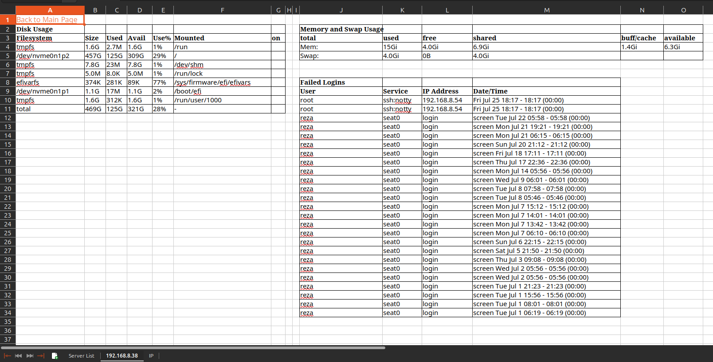

# Server Info Exporter (Ansible + Excel Report)

This project automates the collection of Linux server information (disk, memory, hostname, and failed login attempts) using **Ansible**, and converts the data into a structured **Excel report** using **Python**.

---

## Setup Instructions

Follow these steps to run the project:

### 1️⃣ Install Requirements

```bash
pip install -r requirements.txt
```

---

### 2️⃣ Configure Inventory File

Open `inventory.ini` and replace the IPs and credentials:

```ini
[linux_servers]
172.16.x.x
172.16.x.y

[linux_servers:vars]
ansible_user=your_ssh_user
ansible_ssh_pass=your_ssh_password
ansible_become_pass=your_root_password
ansible_become=yes
# Uncomment the next line to use SSH key authentication instead
# ansible_ssh_private_key_file=~/.ssh/id_rsa
```

> Replace `your_ssh_user`, `your_ssh_password`, and `your_root_password` with your actual credentials.

---

### 3️⃣ Run the Ansible Playbook

```bash
ansible-playbook -i inventory.ini server-info-playbook.yml
```

This will collect server info (disk, memory, logins) and save it into a file named `servers_info.txt`.

---

### 4️⃣ Generate Excel Report

```bash
python generate-excel-report.py
```

After successful playbook execution, this will generate an Excel file named `server-report.xlsx` with:
- A summary sheet containing all servers
- A dedicated sheet per server (with hyperlinks)
- Detailed sections: Disk, Memory, and Failed Logins

---

## 🖼️ Excel Report Preview



---

## 🧪 Tested at Scale

✅ This playbook has been successfully tested on large-scale environments with **over 100 servers simultaneously**.

